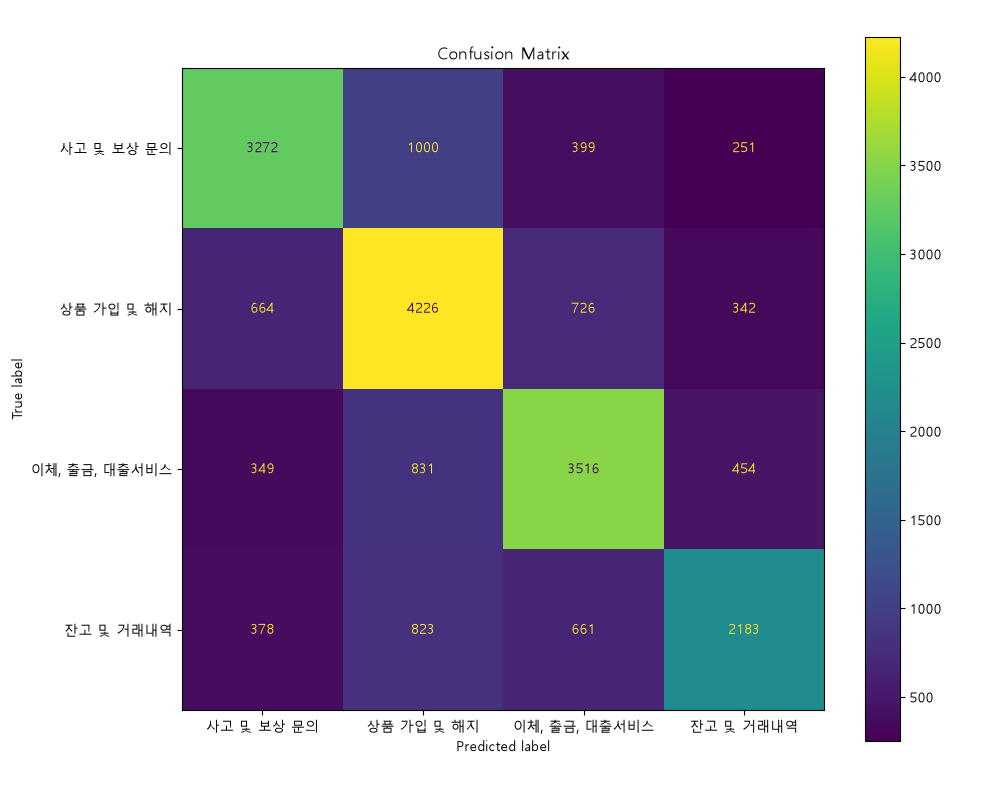

# 금융 민원 분석 AI 대시보드

## 1. 프로젝트 소개

AI Hub 금융/보험 민원(콜센터) 질의응답 데이터를 활용하여 금융 민원 유형을 자동 분류하는 Streamlit 기반 웹 대시보드입니다.

민원 검색, 유형별 필터링, 키워드 분석, 워드클라우드, 머신러닝 기반 민원 분류, 예측 결과 저장 기능을 포함합니다.

---

## 2. 데이터

- 출처: AI Hub 민원(콜센터) 질의응답 데이터
- 분야: 금융/보험
- 데이터 수: 29,490건
- 분류 카테고리:
  - 사고 및 보상 문의
  - 상품 가입 및 해지
  - 이체, 출금, 대출서비스
  - 잔고 및 거래내역

---

## 3. 기술 스택

- Python
- Pandas
- Streamlit
- Scikit-learn
- SQLite
- Joblib
- Matplotlib
- WordCloud

---

## 4. 주요 기능

### 민원 검색 및 필터

검색어와 민원 유형을 기준으로 데이터를 조회할 수 있습니다.

### 민원 유형별 통계

AI Hub 금융/보험 민원 데이터를 유형별로 집계하고 시각화합니다.

### 키워드 분석

전체 민원 및 유형별 민원에서 자주 등장하는 키워드를 분석합니다.

### 머신러닝 기반 민원 분류

TF-IDF Vectorizer와 Multinomial Naive Bayes 모델을 활용하여 민원 유형을 예측합니다.

### 예측 확률 시각화

AI가 예측한 각 민원 유형별 확률을 표와 그래프로 제공합니다.

### 예측 기록 저장

SQLite를 활용해 사용자가 입력한 민원과 AI 예측 결과를 저장하고 조회합니다.

### 워드클라우드

민원 유형별 주요 키워드를 시각적으로 확인할 수 있습니다.

---

## 5. 모델 성능

- 모델: Multinomial Naive Bayes
- 벡터화 방식: TF-IDF Vectorizer
- 데이터 수: 29,490건
- 학습/평가 비율: 8:2
- 정확도: 약 65.56%

---

## 6. 혼동행렬



---

## 7. 실행 방법

```bash
python -m pip install -r requirements.txt